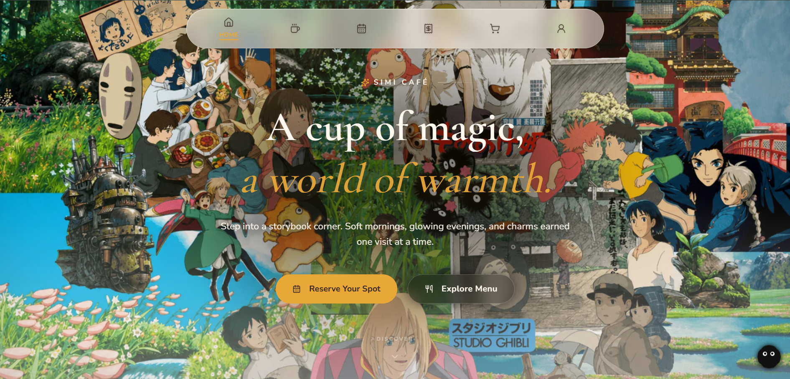
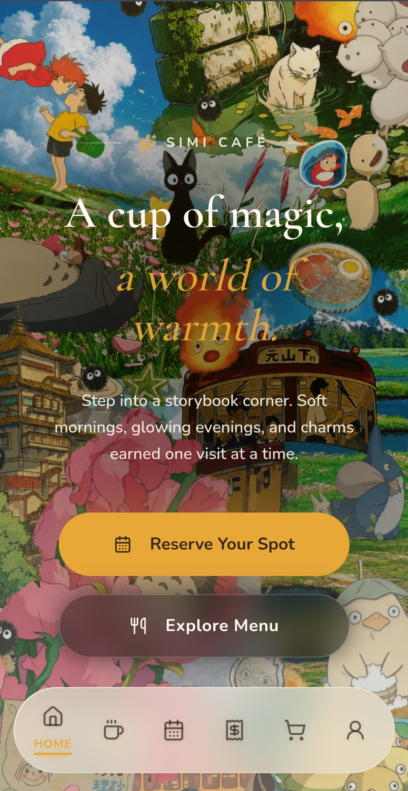

<p align="center">
  
</p>

<h1 align="center">Simi Café</h1>

<p align="center">
  <strong>Modern Full-Stack Restaurant Management Platform</strong>
</p>

<p align="center">
  A production-ready restaurant ecosystem built with Next.js, TypeScript, Express.js, MySQL, and Cloudinary.
</p>

<p align="center">
  Designed to deliver a premium customer dining experience while providing powerful administrative tools for reservations, menu management, content administration, and restaurant operations.
</p>

<p align="center">
  
  
  
  
  
  
  
  
</p>

<p align="center">
  <a href="https://simi-cafe.vercel.app">
    
  </a>
  <a href="https://github.com/Subhamkar1203/Simi-Cafe">
    
  </a>
</p>

---

## Overview

Simi Café is a modern restaurant management platform that combines a visually immersive customer experience with a powerful administration dashboard.

Built using a scalable monorepo architecture, the platform supports reservation management, menu administration, media handling, authentication, and operational workflows within a unified ecosystem.

Inspired by Studio Ghibli aesthetics, Simi Café blends storytelling-driven design with production-grade engineering practices to deliver an engaging user experience across desktop and mobile devices.

---

## Why Simi Café?

Simi Café was built to explore the challenges involved in designing, developing, and deploying a complete restaurant ecosystem.

The project demonstrates how modern frontend technologies, backend services, authentication systems, cloud media storage, and relational databases can work together to support real-world restaurant operations while maintaining a polished customer-facing experience.

---

## Live Demo

### Customer Application

https://simi-cafe.vercel.app

---

## Highlights

* Full-stack monorepo architecture
* Next.js 16 App Router implementation
* JWT-based authentication and authorization
* Cloudinary-powered media management
* MySQL relational database design
* Responsive desktop and mobile experience
* RESTful API architecture using Express.js
* Type-safe development with TypeScript
* Production deployment workflows
* Modern UI inspired by Studio Ghibli aesthetics

---

## Application Preview

<p align="center">
  
  &nbsp;&nbsp;&nbsp;
  
</p>

---

## Technology Stack

<p align="center">
  
</p>

| Category       | Technologies                  |
| -------------- | ----------------------------- |
| Frontend       | Next.js 16, React, TypeScript |
| Styling        | Tailwind CSS                  |
| Backend        | Node.js, Express.js           |
| Database       | MySQL                         |
| Authentication | JWT                           |
| Validation     | Zod                           |
| Media Storage  | Cloudinary                    |
| Deployment     | Vercel, Render                |

---

## Key Features

### Customer Portal

* Interactive digital menu
* Category-based navigation
* Responsive mobile-first experience
* Reservation booking system
* Dynamic content presentation
* Fast page performance
* Optimized media delivery
* Modern animated interface
* Cross-device compatibility

### Administrative Dashboard

* Reservation management
* Menu administration
* Category management
* Media upload system
* Dashboard analytics
* Content administration
* Operational monitoring
* Business management tools

### Authentication & Security

* JWT authentication
* Password hashing
* Protected routes
* Session verification
* Input validation
* Secure API architecture
* Environment-based configuration
* CORS protection

### Media Management

* Cloudinary integration
* CDN-powered image delivery
* Cloud-based asset storage
* Image optimization
* Scalable media infrastructure

---

## Architecture

```text
                    Customer Frontend
                        Next.js 16
                             │
                             ▼
                    Express REST API
                             │
         ┌───────────────────┼───────────────────┐
         │                   │                   │
         ▼                   ▼                   ▼

      MySQL             Cloudinary         Authentication
    Database          Media Storage            JWT

         ▲
         │
         │

   Admin Dashboard
      Next.js 16
```

---

## Monorepo Structure

```text
Simi-Cafe
│
├── docs
│   ├── desktop-view.png
│   └── mobile-view.png
│
├── simi-cafe
│   ├── app
│   ├── components
│   ├── hooks
│   ├── lib
│   ├── public
│   └── styles
│
├── simi-cafe-admin
│   ├── app
│   ├── components
│   ├── hooks
│   ├── services
│   └── lib
│
├── simi-cafe-backend
│   ├── src
│   ├── routes
│   ├── middleware
│   ├── services
│   ├── database
│   └── utils
│
└── README.md
```

---

## Database Design

### Core Entities

* Users
* Reservations
* Menu Items
* Categories
* Media Assets
* Administrative Accounts

### Design Goals

* Data consistency
* Referential integrity
* Query optimization
* Transaction support
* Scalability
* Reliable data relationships

---

## API Features

### Authentication

* User registration
* User login
* Token validation
* Session verification

### Reservation System

* Create reservations
* Update reservation status
* Reservation tracking
* Reservation administration

### Menu Management

* Create menu items
* Update menu items
* Delete menu items
* Category management

### Media Services

* Upload images
* Asset management
* Cloudinary integration
* Media retrieval

---

## Performance Optimizations

* React Server Components
* Dynamic rendering
* Image optimization
* CDN asset delivery
* Lazy loading
* Optimized bundle splitting
* Connection pooling
* Responsive asset loading
* Efficient API architecture

---

## Environment Variables

### Backend

```env
PORT=9092

DB_HOST=your_database_host
DB_USER=your_database_user
DB_PASSWORD=your_database_password
DB_NAME=simi_cafe

JWT_SECRET=your_secure_secret

CLOUDINARY_CLOUD_NAME=your_cloud_name
CLOUDINARY_API_KEY=your_api_key
CLOUDINARY_API_SECRET=your_api_secret

ALLOWED_ORIGINS=https://simi-cafe.vercel.app
```

### Frontend

```env
NEXT_PUBLIC_API_URL=https://your-backend-url.com
NEXT_PUBLIC_CLOUDINARY_CLOUD_NAME=your_cloud_name
```

---

## Local Development

### Clone Repository

```bash
git clone https://github.com/Subhamkar1203/Simi-Cafe.git

cd Simi-Cafe
```

### Install Dependencies

```bash
# Customer Application
cd simi-cafe
npm install

# Admin Dashboard
cd ../simi-cafe-admin
npm install

# Backend API
cd ../simi-cafe-backend
npm install
```

### Create Database

```sql
CREATE DATABASE simi_cafe;
```

### Run Development Servers

```bash
# Backend
cd simi-cafe-backend
npm run dev
```

```bash
# Customer Application
cd simi-cafe
npm run dev
```

```bash
# Admin Dashboard
cd simi-cafe-admin
npm run dev
```

---

## Deployment

### Frontend

* Vercel

### Backend

* Render
* Railway
* AWS
* DigitalOcean

### Database

* Aiven
* PlanetScale
* AWS RDS
* DigitalOcean Managed MySQL

---

## Engineering Highlights

This project demonstrates practical experience with:

* Full-stack application development
* Monorepo architecture
* REST API design
* Authentication and authorization
* Relational database modeling
* Cloud media management
* Production deployment workflows
* Responsive UI engineering
* Modern React patterns
* TypeScript development
* Secure application design
* Scalable system architecture

---

## Future Enhancements

* Online payment integration
* Loyalty and rewards system
* QR menu ordering
* Inventory management
* Kitchen dashboard
* Real-time order tracking
* Customer feedback platform
* Multi-branch support
* Business intelligence reporting
* AI-powered recommendations

---

## Author

### Subham Kar

GitHub: https://github.com/Subhamkar1203

Portfolio Project • Full-Stack Developer

---

## License

This project is provided for portfolio, educational, and demonstration purposes.

All rights reserved.
